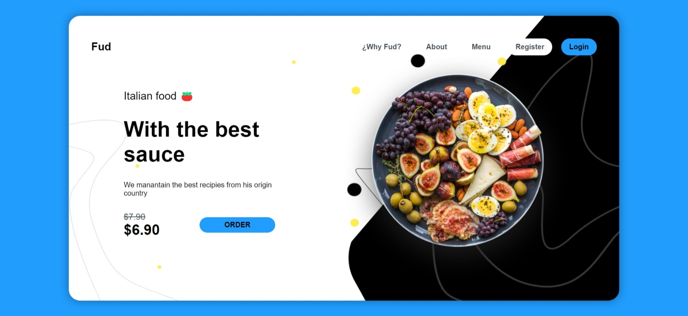

<h1 align="center">Welcome to my Sass Practice 👋</h1>

<p align="center">
  <a href="" target="_blank" rel="noopener noreferrer">
    
  </a>
</p>

<p>
  
  <a href="#" target="_blank">
    
  </a>
</p>

> A small layout made with Sass

## Install

```sh
yarn install
```

## Author

👤 **V01D0**

* Github: [@untitledV01D](https://github.com/untitledV01D)

## Show your support

Give a ⭐️ if this project helped you!

***
_This README was generated with ❤️ by [readme-md-generator](https://github.com/kefranabg/readme-md-generator)_
